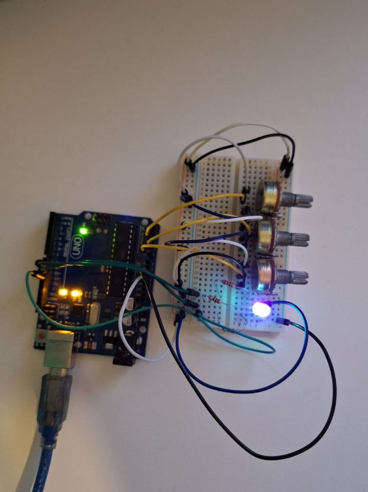
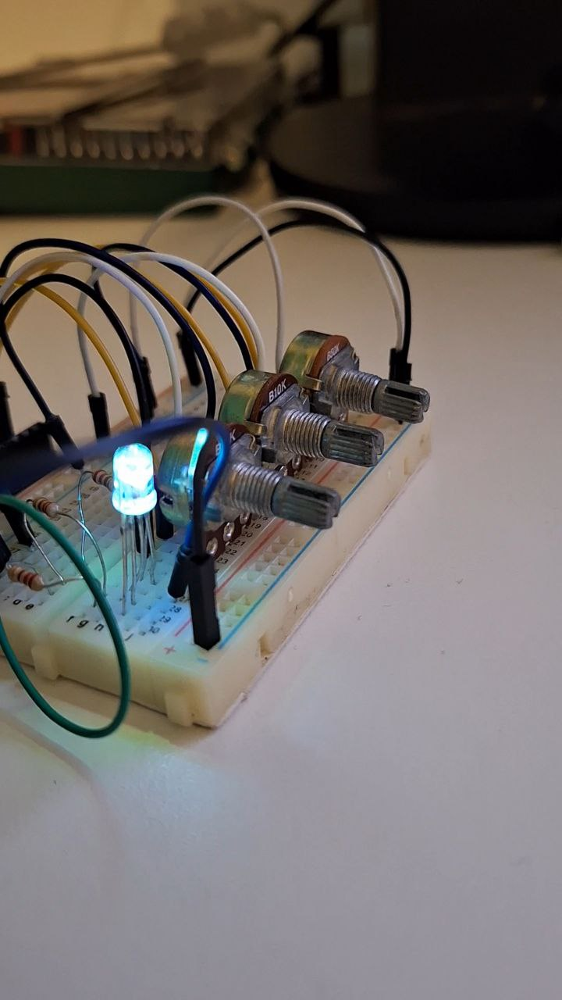
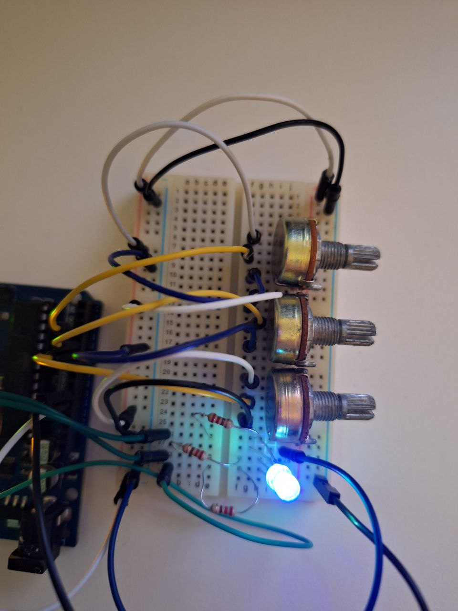

# Introduction to Robotics (2023 - 2024)

_Introduction to Robotics laboratory homeworks, taken in the 3rd year at the Faculty of Mathematics and Computer Science, University of Bucharest.\
Every assignment includes at least requirements, implementation details, code and image files._

## Homework 1
Control an RGB LED using 3 potentiometers, writing the values with Arduino.

Images

- 
- 
- 

**Code**: [homework1](homework1/homework1.ino)

**Video**: [Link](https://www.youtube.com/watch?v=aJKo-8lg_Bs)
