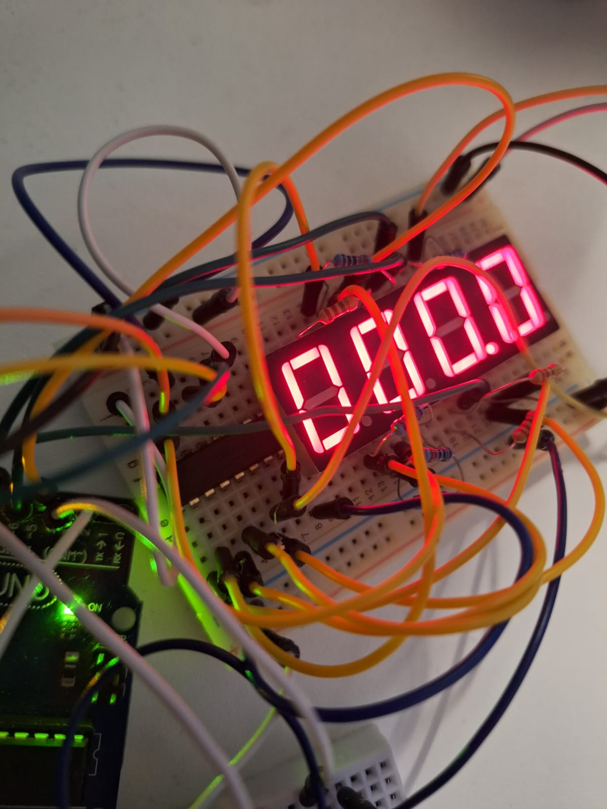

# Introduction to Robotics (2023 - 2024)

_Introduction to Robotics laboratory homeworks, taken in the 3rd year at the Faculty of Mathematics and Computer Science, University of Bucharest.\
Every assignment includes at least requirements, implementation details, code and image files._

## Homework 1
Control an RGB LED using 3 potentiometers, writing the values with Arduino.

	
Images

	  
	  
      

**Code**: [homework1](homework1/homework1.ino)

**Video**: [Link](https://www.youtube.com/watch?v=aJKo-8lg_Bs)

## Homework 2
Simple elevator system with three floors, scalable to any number of floors.\
The elevator has a button and led for each floor.\
It doesn't stack the requests, it goes to the first requested floor and after it finishes it goes to the next one.

	
Components used:

	<ul>
		<li>Arduino Uno</li>
		<li>Breadboard</li>
		<li>Buzzer</li>
		<li>3x Push Button</li>
		<li>4x LED</li>
		<li>5x 220 OHM Resistor</li>
		<li>wires</li>
	</ul>

	
Image

	  

**Code**: [homework2](homework2/homework2.ino)

**Video**: [Link](https://www.youtube.com/watch?v=1sG_I989Z9I)

## Homework 3

Code enables a "cursor" to move around a seven segment display with a joystick and toggle the segments with it's button.\
Highlighted segment is blinking whether it is active or not.\
If you hold the joystick button, all the segments will be reset.

	
Components used:

	<ul>
		<li>Arduino Uno</li>
		<li>Breadboard</li>
		<li>8x 220 OHM Resistor</li>
		<li>7 Segment Display</li>
		<li>Joystick</li>
		<li>wires</li>
	</ul>

	
Image

	  

**Code**: [homework3](homework3/homework3.ino)

**Video**: [Link](https://www.youtube.com/watch?v=sOArNZ-hR0M)

## Homework 4

Stopwatch with a 4x 7 Segment Display and 3 buttons.\
The first button is for starting and stopping the stopwatch.\
The second button is for entering the lap cycle mode / resetting the stopwatch.\
The third button is for adding laps / cycling laps.

	
Components used:

	<ul>
		<li>Arduino Uno</li>
		<li>Medium Breadboard</li>
		<li>Small Breadboard (for buttons)</li>
		<li>3x Buttons</li>
		<li>74HC595 Shift Register</li>
		<li>8x 220 OHM Resistor</li>
		<li>4x7 Segment Display</li>
		<li>wires</li>
	</ul>

	
Images

	  
	  

**Code**: [homework4](homework4/homework4.ino)

**Video**: [Link](https://www.youtube.com/watch?v=sHAmKSQOK5w)

## Homework 5

Smart Environment Monitor and Logger\
It logs and controls a RGB LED based on the environment's light intensity and distance to objects.\
It has a menu system that can be navigated through the serial monitor.

	
Components used:

	<ul>
		<li>Arduino Uno</li>
		<li>Breadboard</li>
		<li>3x 220 Ohm Resistors</li>
		<li>10k Ohm Resistor</li>
		<li>Ultrasonic Sensor</li>
		<li>Light-Dependent Resistor</li>
		<li>RGB LED</li>
		<li>wires</li>
	</ul>

	
Image

	  

**Code**: [homework5](homework5/homework5.ino)

**Video**: [Link](https://www.youtube.com/watch?v=OUmP0h9LdzE)
